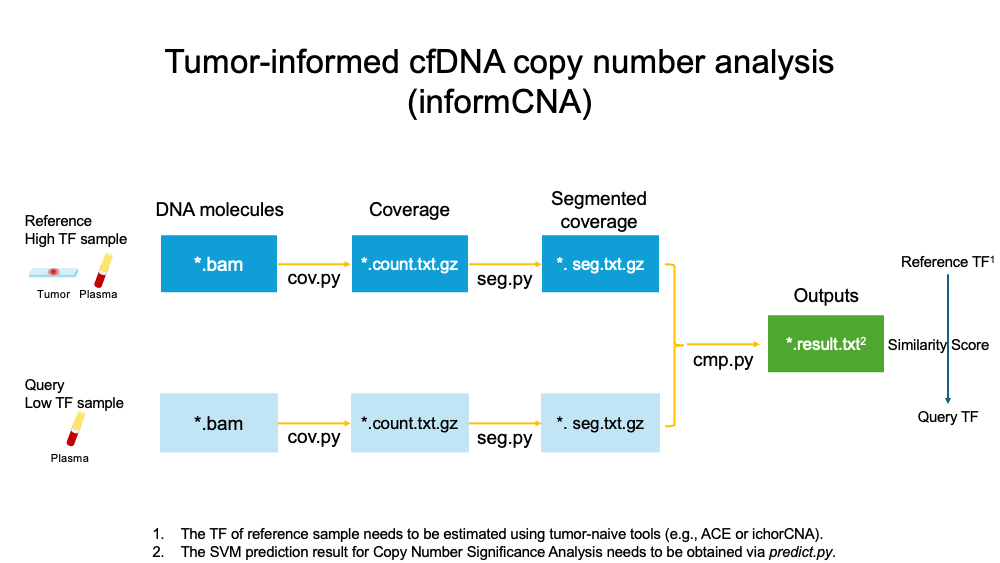

# informCNA

A tumor-informed cfDNA copy number analysis method.

## Installation
### Install Python dependencies
```
pip install -r requirements.txt
```

### Download GC content for hg38 from the UCSC Genome Browser
http://hgdownload.cse.ucsc.edu/gbdb/hg38/bbi/gc5BaseBw/gc5Base.bw

### Download mappability and replication timing for hg38 from google drive
https://drive.google.com/drive/folders/1vlao_MCuiBMXffIQMV2SQz2VYvCaXLYh?usp=share_link

## Usage



### Reads counting (cov.py)
```
python cov.py /path/to/GRCh38.mappable_region.repli_time.bed.gz /path/to/gc5Base.bw /path/to/GRCh38.mappable_region.repli_time.bed.gz /path/to/BAM_file /path/to/count.txt.gz
```

### Segmentation (seg.py)
```
python seg.py /path/to/count.txt.gz /path/to/seg.txt.gz
```
For tumor samples, include the `--high` parameter:
```
python seg.py --high /path/to/count.txt.gz /path/to/seg.txt.gz
```
The output of

### Comparison (cmp.py)
To compare reference and query seg.txt.gz files
```
python cmp.py /path/to/ref_seg.txt.gz /path/to/qry_seg.txt.gz /path/to/cmp_result.txt
```

### Output Format
The output is a one-line result in the following format:
```
Simlairy socre,
Kendall’s tau in correlation analysis,
the associated p-value,
median p-value of upper triangle in segment pairwise comparison matrix,
median p-value of lower triangle,
median p-value of square sections,
p-values of comparing upper triangle and square sections (PU),
p-values of comparing lower triangle and square sections (PL),
p-values of comparing upper and lower triangles (PU−L)
```

## Tumor Fraction Estimation
- **Reference Sample:**
    The tumor fraction of the reference sample can be obtained using one of the following tools:
  - [ACE](https://github.com/tgac-vumc/ACE)
  - [ichorCNA](https://github.com/broadinstitute/ichorCNA)
  - [Rascal](https://github.com/crukci-bioinformatics/rascal)

- **Query Sample:**
    The tumor fraction of the query sample can be calculated as:
    ```
    Tumor fraction of reference sample × similarity score
    ```
    The tumor positivity of the query sample can be determined using an SVM model:
    ```
    python predict.py /path/to/svm_model.sav /path/to/cmp_result.txt
    ```
